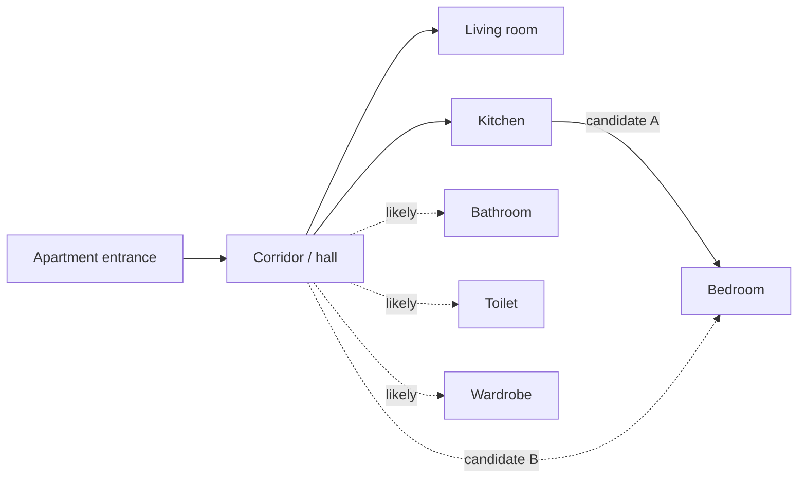

# Stage 5 — Room-adjacency graph

Nodes are spaces. A solid arrow below means access is visible or strongly indicated; a question mark means the photos do not show the complete doorway.

| Edge | Support | Status |
|---|---|---|
| Exterior → hall | Entrance door in [16](../../images/16.webp) | Directly visible |
| Hall → living room | Living room double doors in [05–06](../../images/05.webp); two isolated rooms per listing | Strong, reverse side not photographed |
| Hall → kitchen | Kitchen decorative door opens toward wood-look floor in [10](../../images/10.webp); hall floor in [12](../../images/12.webp)/[16](../../images/16.webp) | Strong, exact matching junction unresolved |
| Kitchen → bedroom | Bedroom door opens to patterned tile matching kitchen in [08](../../images/08.webp) and [09–10](../../images/09.webp) | Favored, not directly verified from kitchen side |
| Hall → bedroom | Alternative if the patterned tile in 08 belongs to an unseen tiled hall spur | Possible, no photo of such spur |
| Hall → bathroom, toilet, wardrobe | Separate spaces visible in [13–15](../../images/13.webp); listing calls corridor large with wardrobe | Likely, positions unverified |

The **access graph** carries more support than the **wall-adjacency graph**. It does not tell us which room lies left/right of another, whether the windows form one straight façade, or whether the corridor turns. Those choices belong in the candidate stage.
